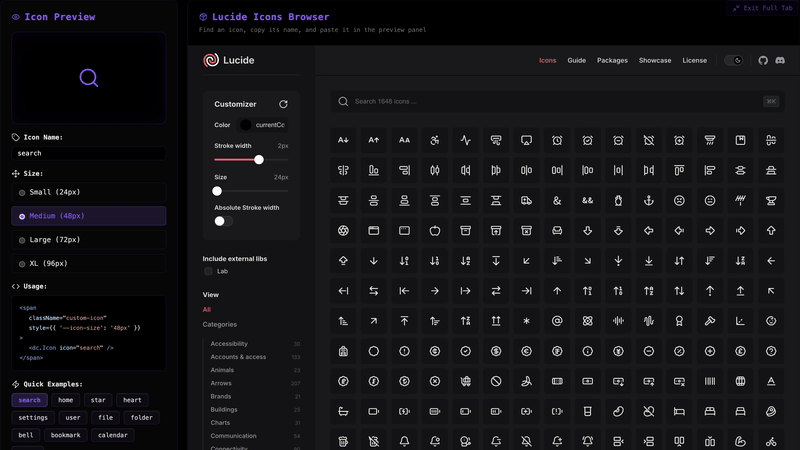

  
  
  <h1 align="center">ICONS PACK</h1>
  <h3 align="center"> Lᴜᴄɪᴅᴇ Iᴄᴏɴs Pʀᴇᴠɪᴇᴡᴇʀ ᴀɴᴅ Bʀᴏᴡsᴇʀ </h3>

  <!-- TOP PURPLE LINKS -->
  
  
  
   
  <!-- BOTTOM GOLD TAXONOMY -->
  
  
  
  

<i>A design and developer utility combining a live icon previewer frame, sizing selectors, real-time code snippet generators, and an integrated sandboxed Lucide icons website browser.</i>

The Icons Pack component provides a comprehensive dashboard environment inside an Obsidian workspace leaf for exploring and implementing Lucide icons. It divides the workspace into a left-side live interactive controller and code builder, and a right-side sandboxed iframe loading the official Lucide library.

## Features

- **🛡️ Runtime & Agentic Safety**: Integrates a polling watch daemon listening to `data/mcp_commands.json` for hot reloading, and uses local cache helpers under `assets/cache/` to ensure offline stability.
- **🔐 Sandbox Security**: Embeds the Lucide browser in an iframe restricted with strict sandboxing attributes (`allow-same-origin allow-scripts allow-popups allow-forms`) to avoid frame hijacking.
- **📐 User Interface & Developer Snippets**: Offers live search previewing, xl/large/medium/small radio selectors, quick template buttons, and real-time generation of clean copy-paste React `<dc.Icon>` span code snippets.

## Directory Index & Components

The package exposes the following compiled files:

| File | Description |
| :--- | :--- |
| **[ICONS PACK.md](ICONS PACK.md)** | The main entry point note to be loaded in the Obsidian workspace leaf. |
| **[src/index.jsx](src/index.jsx)** | Main entry bootstrapper coordinating the watch reload daemon and FullTab style injection. |
| **[src/App.jsx](src/App.jsx)** | Main layout component managing the state and organizing panels. |
| **[src/components/PreviewPanel.jsx](src/components/PreviewPanel.jsx)** | Left UI panel handling icon inputs, sizes, quick templates, and code generator. |
| **[src/components/BrowserPanel.jsx](src/components/BrowserPanel.jsx)** | Right UI panel housing the sandboxed Lucide iframe browser. |
| **[src/utils/domUtils.js](src/utils/domUtils.js)** | DOM traversal helper functions to locate target leaf wrappers. |
| **[src/utils/loadScript.js](src/utils/loadScript.js)** | Offline caching local script loader. |
| **[METADATA.md](METADATA.md)** | Packaging manifest containing security, network, and indexing declarations. |
| **[CONTRIBUTION.md](CONTRIBUTION.md)** | Developer roadmap and layout rules. |
| **[LICENSE.md](LICENSE.md)** | MIT open-source license. |

## Contributors
- beto.group
